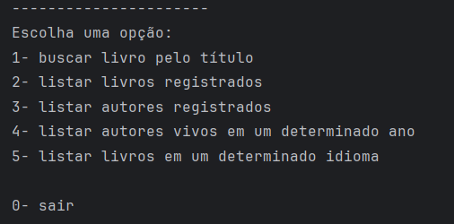
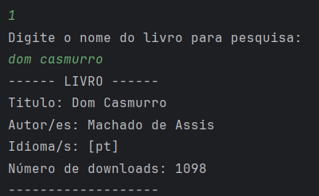
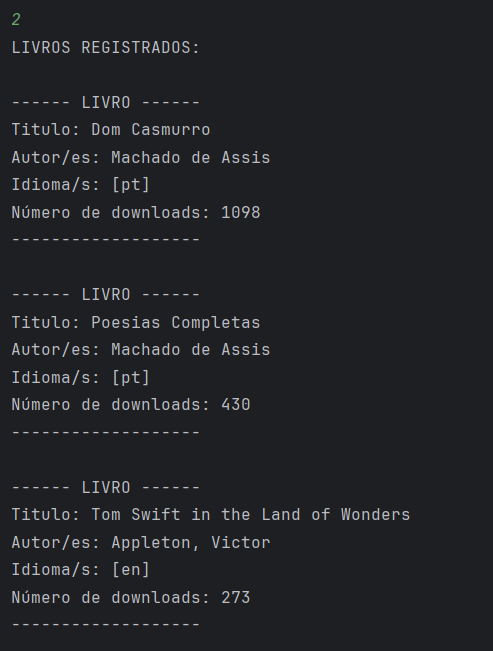
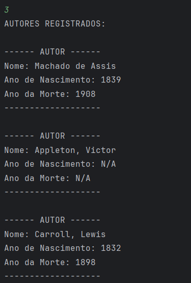

# :books: Challenge LiterAlura 
Challenge Conversor de Moedas implementado com a [API Gutendex](https://gutendex.com). 
Proposto pela Oracle Next Education, na formação de Back-end Java, em parceria com a Alura.

## :wrench: Sobre o projeto
- Uma aplicação back-end simples e robusta, estruturada utilizando as melhores práticas de programação, arquitetada em layers, a qual separa o código por funcionalidades.
- O objetivo da aplicação é buscar livros através do consumo da API Gutendex, realizar a persistência dos dados dos livros em um banco de dados relacional, e oferecer funcionalidades para a pesquisa dos registros já persistidos.
- A interação com a aplicação é realizada através de linhas de comando, com o auxílio de um menu de opções. 

## :clipboard: Como funciona?
- Ao iniciar a aplicação, o menu de interação é exibido, permitindo que o usuário escolha uma das opções, entre 1 e 5, sendo o 0 para finalizar a aplicação (o input do usuário deve ser um número inteiro):
 

  

- Ao escolher a opção "1- buscar livro pelo título", o usuário deverá digitar o nome de um livro ou de um autor para busca, o resultado será exibido e persistido no banco de dados:
 

  

- Com livros e autores já persistidos no banco de dados, o usuário pode optar pelas opções entre 2 e 5, as quais são responsáveis por fazer buscas personalizadas dos registros no banco:
 

  

 

  

 

## :computer: Tecnologias e ferramentas utilizadas
- Java (JDK 17)
- Spring Boot e JPA Hibernate
- IntelliJ e Git
- [Gutendex API](https://gutendex.com)
- [PostgreSQL](https://www.postgresql.org)